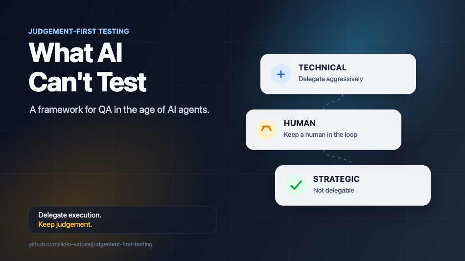

# Judgement-First Testing



> *A framework for QA in the age of AI agents.*  
> *AI should amplify the tester, not replace the thinking.*

[Read the article on Medium →](https://medium.com/@ilidiovatuva/what-ai-cant-test-270a7cff1c9d)

---

## Why This Exists

AI is now embedded in every stage of QA. Agents write the test plan, generate the cases, automate the suite, and produce the report. Output goes up. Speed goes up.

What goes down is harder to measure, but visible:

- Tests that pass but don't reflect how the system is actually used.
- Coverage numbers that grow while real risk goes unexamined.
- Tickets closed without anyone asking *why* the feature exists.
- Engineers who can prompt an agent but can no longer reason about a failure mode unaided.

A passing test no longer means the system works. It means the agent followed the prompt correctly. Those are not the same thing.

The shift this framework responds to is straightforward:

> When machines produce most of the artefacts, the scarce resource is no longer execution — it's **judgement**.

Judgement-First Testing is an attempt to define, explicitly, where judgement still has to live: which parts of the work can be delegated to an agent, which parts require a human in the loop, and which parts cannot be delegated at all.

It is not anti-AI. It is a structure for using AI without losing the ability to think about quality.

---

## The Framework

Quality has three layers. Most QA lives in one.

| Layer | Delegate to AI? |
|-------|-----------------|
| **Technical** | Yes, aggressively |
| **Human** | With a human in the loop |
| **Strategic** | No |

### Technical
*What the system does.*

Architecture, APIs, data flows, edge cases, load, concurrency, failure modes.  
This is where AI genuinely excels. Delegate aggressively here.  
An agent can generate a test plan, produce test cases, and automate faster than any human.  
Let it.

**This layer is largely delegable.**

---

### Human
*What the user actually experiences.*

Personas, friction, intent vs. reality, cognitive load, emotional response.  
AI can help map this — but it cannot feel it.  
It doesn't get confused by an ambiguous button. It doesn't abandon a flow out of frustration.  
It doesn't notice that the error message, while technically correct, feels like an accusation.

This is exploratory testing. This is empathy as a quality tool.

**This layer requires a human in the loop.**

---

### Strategic
*What the business cannot afford to get wrong.*

Risk, long-term dependencies, systemic failure, roadmap impact.  
This is the conversation in the refinement session that determines what matters before a single test is written.  
It's the risk analysis that runs in parallel while agents execute.  
It's the synthesis that happens at the end — when you look at the agent's output and say: *this is not enough*.

No agent has this context. No agent carries this responsibility.

**This layer is not delegable.**

---

## How It Works in Practice

Judgement-First Testing is not a process. It's a destination.

```
REFINEMENT
Every ticket is documented with intention — not just acceptance criteria,
but risk surface, user impact, and strategic dependencies.
This is where judgement-first thinking begins.
        ↓
PARALLEL EXECUTION
        ▲  shared context: risk map · personas · incident history
        │
┌────────────────────────────────────────────────────┐
│  AI AGENTS                  HUMAN                  │
│  ──────────────             ──────────────         │
│  Test Plan          ⇄       Exploratory            │
│  Test Cases         ⇄       Risk reasoning         │
│  Automation         ⇄       Intuition              │
│  Regression sweeps  ⇄       Hypothesis generation  │
│  Coverage / metrics ⇄       Stakeholder calibration│
│  Anomaly detection  ⇄       Bias & fairness review │
│                                                    │
│         ── shared artefacts & feedback ──          │
└────────────────────────────────────────────────────┘
        ↓
SYNTHESIS
The agent's output alone is not the answer. Human judgement closes the gap.
The result takes whatever form the project needs:
a document, a pipeline, a go/no-go decision, an e-mail.
The format is irrelevant. Reaching a real quality decision is not.
```

---

## The Steps

Four steps, each anchored to a layer and an owner. Loosely sequential, heavily overlapping in practice.

| Step | Lives in | Owned by | What happens |
|------|----------|----------|--------------|
| **Map the system** | Technical | AI-led, human-verified | Understand what exists before deciding what to test |
| **Question intentions** | Strategic | Human | Ask *why*, not just *what* — tickets lie, intentions don't |
| **Validate behaviour** | Technical + Human | AI + Human in parallel | Test what the system *becomes* under real conditions, not only what it was designed to do |
| **Synthesise & decide** | Strategic | Human | Interpret results, decide what they mean, convert into action. Quality without consequence is just documentation. |

---

## Getting Started

Try this on your next ticket. No new tools required.

1. **Before you open any agent**, write one sentence per layer:
   - *Technical risk* — what could break in the system?
   - *Human risk* — where could a real user get confused, frustrated, or excluded?
   - *Strategic risk* — what would this feature failing in production actually cost?
2. **Decide what to delegate before you prompt.** Use the [delegation table](#the-framework). Anything in the *Strategic* layer stays with you.
3. **After the agent finishes, do the synthesis step yourself.** Don't ship the agent's output as the answer — read it, challenge it, decide what's missing, then decide.

If those three sentences are harder to write than the test plan itself, that's the point.

For what this looks like on real-shaped tickets, see the [case studies](docs/examples/case-studies.md).

---

## Who This Is For

- QA engineers working in AI-augmented pipelines who suspect output is rising while quality isn't.
- Teams whose features pass every test and still solve the wrong problem.
- Engineering leaders who need a defensible answer to *"what should we delegate to agents?"*

---

## What This Is Not

- A replacement for automation.
- An argument against AI in testing.
- A process with mandatory artefacts, ceremonies, or templates.

It's a decision layer: what to automate, what to keep in human hands, and how to tell the difference.

---

## Related Work

- [What AI Can't Test](https://medium.com/@ilidiovatuva/what-ai-cant-test-270a7cff1c9d) — the companion article on Medium that introduces this framework
- [`ai-augmented-testing`](https://github.com/ilidio-vatuva/ai-augmented-testing) — the technical implementation: agents, pipelines, and automation architecture built on top of this framework
- [`qa-platform-zero-to-one`](https://github.com/ilidio-vatuva/qa-platform-zero-to-one) — real-world QA from scratch: how these principles were applied building a QA function from the ground up

---

## Documentation

- [Framework Overview](docs/01-framework-overview.md) — the three layers and the delegation rule at a glance
- [Technical Layer](docs/02-technical.md) — what to delegate aggressively to agents
- [Human Layer](docs/03-human.md) — where a tester stays in the loop
- [Strategic Layer](docs/04-strategic.md) — what no agent can own
- [Case Studies](docs/examples/case-studies.md) — worked examples of the framework applied to real tickets
- [Contributing](CONTRIBUTING.md) — how to submit an anonymised case study or propose a change

---

## Author

**Ilídio Vatuva** — QA Engineer at Adidas.  
Building quality systems that scale without losing the human layer.

[LinkedIn](https://www.linkedin.com/in/ilidiovatuva) · [GitHub](https://github.com/ilidio-vatuva)
